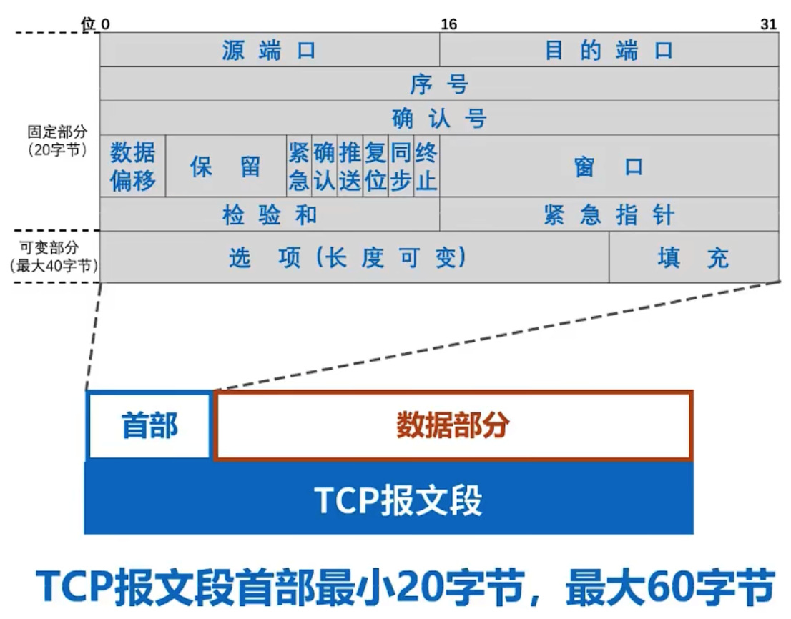
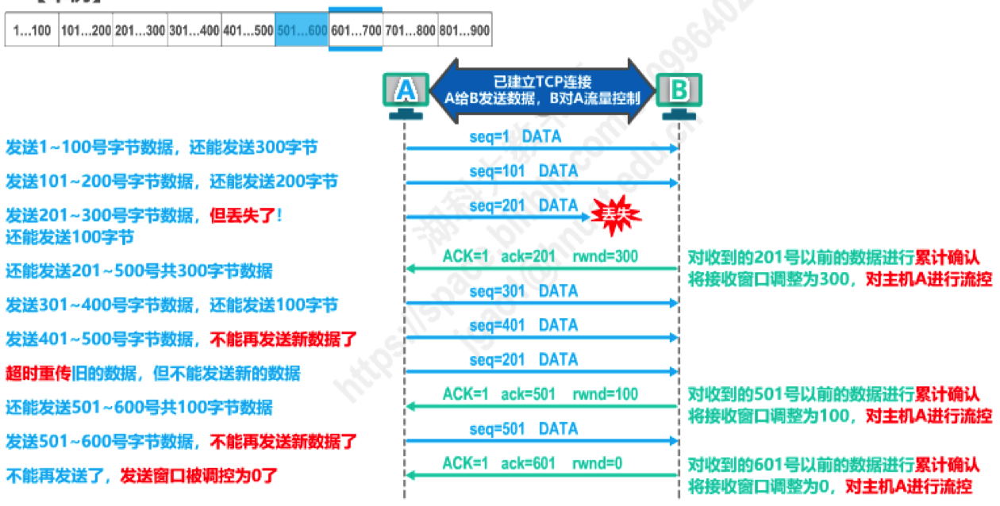
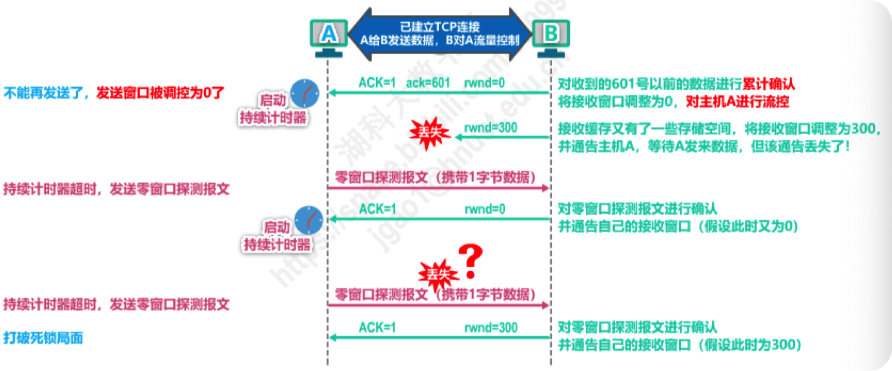
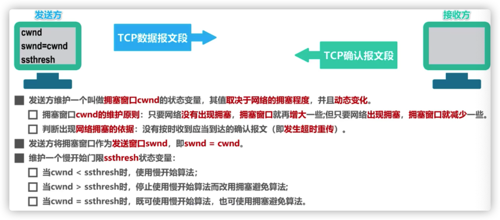

[TOC]

# TCP概述

## TCP的特点

1. 点对点
2. 可靠，按顺序的字节流
3. 流水线机制
4. 发送方/接收方缓存
5. 全双工（full-duplex）连接（同一连接中能够传输双向数据流）
6. 面向连接的
   - 通信双方在发送数据之前必须建立连接。
   - 连接状态只在连接的两端中维护，在沿途节点中并不维护状态。
   - TCP连接包括：两台主机上的缓存、连接状态变量、socket等
7. 流量控制机制

## TCP段结构

- 序列号
  - 序列号指的是segment中第一个字节的编号，而不是segment的编号
  - 建立TCP连接时，双方随机选择序列号

- ACK
  - 希望接收到的**下一个字节的序列号**（所以TCP不是百分百的GBN也不是百分百的SR）
  - 累计确认：该序列号之前的所有字节均已被正确接收到

# TCP可靠数据传输

- TCP在IP层提供的不可靠服务基础上实现可靠数据传输服务
- 流水线机制
- 累积确认
- TCP使用单一重传定时器
- 触发重传的事件
  - 超时
  - 收到重复ACK

## TCP的超时重传时间选择

RTT：round trip time

RTO：retransmission time out

### 先计算RTTs

- **不能直接使用某次测量得到的RTT样本（比如RTT1，RTT0）来计算超时重传时间RTO.**

- 利用每次测量得到的RTT样本，计算**加权平均往返时间RTTs**（又称为平滑的往返时间）
  $$
  R T T_{s 1}=R T T_{1}\\
  \text { 新的 } R T T_{S}=(1-\alpha) \times \text { 旧的 } R T T_{S}+\alpha \times \text { 新的 } R T T \text { 样本 }
  $$
  在上式中, $0 \leq \alpha<1$ :

  - 若 $\alpha$ 很接近于 0 ，则新RTT样本对RTT 的影响不大; 

  - 若 $\alpha$ 很接近于 1 ，则新RTT样本对RTT 的影响较大; 

​		已成为建议标准的RFC6298推苃的 $\alpha$ 值为 $1 / 8$ ，即 $0.125$ 。

- 用这种方法得出的加权平均往返时间RTTs就比测量出的RTT值更加平滑。
- 显然，超时重传时间RTO应略大于加权平均往返时间RTTS。

### 再计算RTO

### 往返时间RTT的测量比较复杂

针对出现**超时重传时无法测准往返时间RTT**的问题，Karn提出了一个算法：

在计算加权平均往返时间RTTs时，**只要报文段重传了，就不采用其往返时间RTT样本**。也
就是出现重传时，不重新计算RTTs，进而超时重传时间RTO也不会重新计算。

- 这又引起了新的问题。设想出现这样的情况：报文段的时延突然增大了很多，并且之后很长一段时间都会保持这种时延。

  因此在原来得出的重传时间内，不会收到确认报文段。于是就重传报文段。

  但根据Karn算法，不考虑重传的报文段的往返时间样本。这样，超时重传时间就无法更新。这会导致报文段反复被重传。

因此，要对Karn算法进行修正。方法是：

**报文段每重传一次，就把超时重传时间RTO增大一些**。典型的做法是将新RTO的值取为旧RTO值的2倍，如下所示：

## TCP滑动窗口原理

## 快速重传机制

- TCP的实现中，如果发生超时，超时时间间隔将重新设置，即将超时时间间隔加倍，导致其很大
- 如果某个分组丢失，可能会引发多个重复的ACK

- 如果sender收到对同一数据的3个ACK，则假定该数据之后的段己经丢失

# TCP流量控制

## 功能

接收方会为TCP连接分配Buffer，有时候上层应用处理buffer中数据速度可能较慢，TCP的流量控制会控制发送方传输的速度，不要太快以至于淹没接收方（buffer溢出），流量控制是一种速度匹配机制。

## 原理

- **Buffer中的可用空间(spare room)**=RcvWindow=RcvBuffer-[LastByteRcvd-LastByteRead]

- Receiver在Segment的头部字段将RcvWindow 的值告诉Sender
- Sender收到后会限制自己已经发送的但还未收到ACK的数据不超过接收方的空闲Revwindow尺寸

## 过程

# TCP连接管理

## 建立连接：三次握手

- SYN=1的两个报文段不能携带信息，但是要占用序列号
- seq=x是客户随机选择的初始序列号
- seq=y是服务器随机选择的自己的初始序列号

### 为什么不能简化为两次握手

## 释放连接：四次挥手

### 为什么不能简化为两次挥手

# TCP拥塞控制

## 概述

在某段时间，若对网络中某一资源的需求超过了该资源所能提供的可用部分，网络性能就要变坏。
这种情况就叫做**拥塞(congestion)**。

- 在计算机网络中的链路容量（即带宽）、交换结点中的缓存和处理机等，都是网络的资源。

**若出现拥塞而不进行控制，整个网络的吞吐量将随输入负荷的增大而下降。**

## 拥塞控制算法

### 假定条件

数据是单方向传送，而另一个方向只传送确认。

接收方总是有足够大的缓存空间，因而发送方发送窗口的大小由网络的拥塞程度来决定。

以最大报文段MSS的个数为讨论问题的单位，而不是以字节为单位。

### 发送方事件

### 慢开始和拥塞避免

传输轮次：

- 发送方给接收方发送数据报文段后，接收方给发送方发发回相应的确认报文段
- **一个传输轮次所经历的时间其实就是往返时间RTT**，往返时间并非是恒定的数值
- 使用传输轮次是为了强调把拥塞窗口所允许发送的报文段都连续发送出去，并受到了对已发送的最后一个报文段的确认

### 快重传和快恢复

- 慢开始和拥塞避免算法是1988年提出的TCP拥塞控制算法(**TCP Tahoe**版本）。

- 1990年又增加了两个新的拥塞控制算法(改进TCP的性能），这就是快重传和快恢复（**TCP Reno**版本）
  - 有时，个别报文段会在网络中丢失，但实际上网络并未发生拥塞。这将导致发送方超时重传，并误认为网络发生了拥塞；发送方把拥塞窗口cwnd又设置为最小值1，并错误地启动慢开始算法，因而降低了传输效率。
  - 采用快重传算法可以**让发送方尽早知道发生了个别报文段的丢失**。

#### 快重传

所谓快重传，就是使发送方**尽快进行重传**，而不是等超时重传计时器超时再重传。

- 要求接收方不要等待自己发送数据时才进行捎带确认，而是要**立即发送确认**；
- 即使收到了失序的报文段也要立即发出对已收到的报文段的**重复确认**。
- 发送方一旦收到**3个连续的重复确认**，就将相应的报文段立即重传，而不是等该报文段的超时重传计时器超时再重传。
- 对于个别丢失的报文段，发送方不会出现超时重传，也就不会误认为出现了拥塞（进而降低拥塞窗口cwnd为1）。**使用快重传可以使整个网络的吞吐量提高约20%**。

#### 快恢复

发送方一旦收到3个重复确认，就知道现在只是丢失了个别的报文段。于是不启动慢开始算法，而执行快恢复算法：

- **发送方将慢开始门限ssthresh值和拥塞窗口cwnd值调整为当前窗口的一半；开始执行拥塞避免算法。**

- 也有的快恢复实现是把快恢复开始时的拥塞窗口cwnd值再增大一些，

  即等于新的ssthresh + 3。

  - 既然发送方收到3个重复的确认，就表明有3个数据报文段已经离开了网络；
  - 这3个报文段不再消耗网络资源而是停留在接收方的接收缓存中；
  - 可见现在网络中不是堆积了报文段而是减少了3个报文段。因此可以适当把拥鑫窗口扩大些。

### 总结

