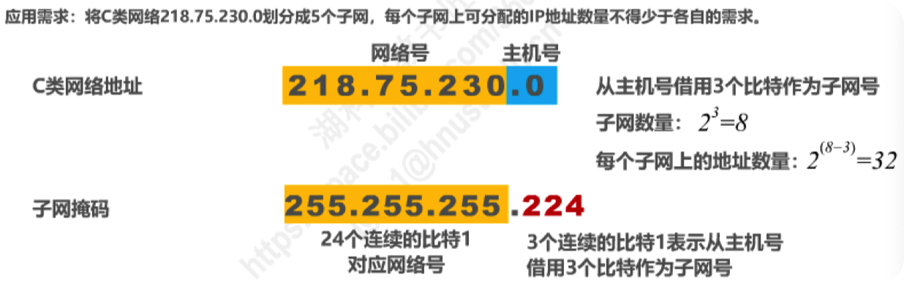

[TOC]

CIDR：

# 4.1概述

## 网络层任务

网络层的主要任务是实现网络互连，进而实现数据包在各网络之间的传输。

### 实现网络层任务需要解决的问题

#### 网络层向运输层提供的服务

（“可靠传输”还是 “不可靠传输”）

#### 网络层寻址问题

#### 路由选择问题

路由器收到数据后，是依据什么来决定将数据包从自己的哪个接口转发出去？

- 依据数据包的目的地址和路由器中的路由表

但在实际当中，路由器是怎样知道这些路由记录？

- 由用户或网络管理员进行人工配置，这种方法只适用于规模较小且网络拓扑不改变的小型互联网
- **另一种是实现各种路由选择协议，由路由器执行路由选择协议中所规定的路由选择算法，而自动得出路由表中的路由记录，这种方法更适合规模较大且网络拓扑经常改变的大型互联网**

## 网络层概述

因特网(Internet）是目前全世界用户数量最多的互联网，它使用TCP/IP协议栈。

由于TCP/P协议栈的网络层使用**网际协议IP**，它是整个协议栈的核心协议，因此在TCP/IP协议栈中网络层常称为**网际层**。

综上所述，我们通过学习TCP/IP协议栈的网际层来学习网络层的理论知识和实践技术。

# 4.2.提供的服务

## 面向连接的虚电路服务

## 无连接的数据报服务

- **采用这种设计思路的好处是**：网络的造价大大降低，运行方式灵活，能够适应多种应用。
- 互连网能够发展到今日的规模，充分证明了当初采用这种设计思路的正确性。

## 对比

# 4.3.IPv4

## 4.3.1.概述

在TCP/IP体系中，IP地址是一个最基本的概念，我们必须把它弄清楚。

IPv4地址就是给因特网(Internet）上的**每一台主机(或路由器）的每一个接口**分配一个在全世界范围内是唯一的**32比特**的标识符。

IP地址由**因特网名字和数字分配机构ICANN(Interet Corporation for Assigned Names and Numbers)**进行分配。

- 我国用户可向亚太网络信息中心APNIC (Asia Pacihic Network Information Center)申请IP地址，需要缴费。
- 2011年2月3日，互联网号码分配管理局IANA(由ICANN行使职能）宣布，IPv4地址己经分配完毕。
- 我国在2014至2015年也逐步停止了向新用户和应用分配1Pv4地址。同时全面开展商用部署1Pv6。

IPv4地址的编址方法经历了如下三个历史阶段：

32比特的IPv4地址不方便阅读、记录以及输入等，因此IPv4地址采用**点分十进制表示方法**以方便用户使用

**IP 地址的一些重要特点**

(1) **IP 地址是一种分等级的地址结构**。分两个等级的好处是：

- **第一**，IP 地址管理机构在分配 IP 地址时只分配网络号，而剩下的主机号则由得到该网络号的单位自行分配。这样就方便了 IP 地址的管理。
- **第二**，路由器仅根据目的主机所连接的网络号来转发分组（而不考虑目的主机号），这样就可以使路由表中的项目数大幅度减少，从而减小了路由表所占的存储空间。

(2) **实际上 IP 地址是标志一个主机（或路由器）和一条链路的接口**。

- 当一个主机同时连接到两个网络上时，该主机就必须同时具有两个相应的 IP 地址，其网络号 net-id 必须是不同的。这种主机称为**多归属主机** (multihomed host)。
- 由于一个路由器至少应当连接到两个网络（这样它才能将 IP 数据报从一个网络转发到另一个网络），因此**一个路由器至少应当有两个不同的 IP 地址**。

(3) **用转发器或网桥连接起来的若干个局域网仍为一个网络**，因此这些局域网都具有同样的网络号 net-id。

(4) **所有分配到网络号 net-id 的网络，无论是范围很小的局域网，还是可能覆盖很大地理范围的广域网，都是平等的。**

## 4.3.2.编址方法

### 4.3.2.1.分类编址

- 每一类地址都由两个固定长度的字段组成，其中一个字段是**网络号 net-id**，它标志主机（或路由器）所连接到的网络，而另一个字段则是**主机号 host-id**，它标志该主机（或路由器）。

- 主机号在它前面的网络号所指明的网络范围内必须是唯一的。

- 由此可见，**一个 IP 地址在整个互联网范围内是唯一的**。

#### A类地址

$$
可指派的网络数量为 ： 2^{(8-1)}-2=124\\
（除去最小网络号和最大网络号）
$$

$$
每个网络中可分配的IP地址数量为 ： 2^{24}-2=16777214
$$

#### B类地址

$$
可指派的网络数量为 ： 2^{(16-2)}=16384
$$

$$
每个网络中可分配的IP地址数量为 ： 2^{16}-2=65534
$$

注意：

有些教材中指出128.0是保留网络号，B类第一个可指派的网络号为128.1。
但根据2002年9月发表的RFC 3330文档，128.0网络号已经可以分配了。

#### C类地址

$$
可指派的网络数量为 ： 2^{(24-3)}=2097152
$$

$$
每个网络中可分配的IP地址数量为 ： 2^{8}-2=254
$$

注意：

有些教材中指出192.0.0是保留网络号，C类第一个可指派的网络号为192.0.1。
但根据2002年9月发表的RFC 3330文档，192.0.0网络号已经可以分配了。只不过目前还没有分配出去。

#### 辨别IP地址方法

1. **根据地址左起第一个十进制数的值，可以判断出网络类别**

   小于127的为A类，

   128～191的为B类，

   192~223的为C类

2. **根据网络类别，就可找出地址中的网络号部分和主机号部分**

  A类地址网络号为左起第一个字节，

  B类地址网络号为左起前两个字节，

  C类地址网络号为左起前三个字节：

3. **以下三种情况的地址不能指派给主机或路由器接口：**

   A类网络号0和127

   主机号为“全0”，这是网络地址

   主机号为“全1”，这是广播地址

#### 特殊IP地址

#### 给网络分配IP地址的原则

- 橙色网络中有65534台主机+1个路由器接口需要分配地址，刚好超出了B类地址的容量，所以给分配A类网络号
- 蓝色网络同理
- 粉色网络只包含两个路由器的接口，但它也是一个网络！
- 绿色网络是三台交换机互联起来的**交换式以太网**，有16+24台主机+1个路由器接口需要分配地址

### 4.3.2.2.划分子网

https://www.bilibili.com/video/BV1c4411d7jb?p=45&spm_id_from=pageDriver

**为什么要划分子网**

在 ARPANET 的早期，IP 地址的设计确实不够合理：

- IP 地址空间的利用率有时很低。
- 给每一个物理网络分配一个网络号会使路由表变得太大因而使网络性能变坏。
- 两级的 IP 地址不够灵活。

为新增网络申请新的网络号会带来以下弊端：

- 需要等待时间和花费更多的费用
-  会增加其他路由器中路由表记录的数量
- 浪费原有网络号中剩余的大量IP地址

所以可以借用16位主机号中的8位作为子网号

如果未在图中标记子网号部分，那么我们和计算机又如何知道分类地址中主机号有多少比特被用作子网号了呢？

- 用子网掩码

#### 子网掩码

32比特的子网掩码可以表明分类IP地址的主机号部分被借用了几个比特作为子网号

- 子网掩码使用连续的比特1来对应网络号和子网号
- 子网掩码使用连续的比特0来对应主机号
- 将划分子网的IPv4地址与其相应的子网掩码进行逻辑与运算就可得到IPv4地址所在子网的网络地址

可以从主机号部分借用一部分比特作为子网号

32比特的子网掩码可以表明分类IP地址的主机号部分被借用了几个比特作为子网号

- 子网掩码使用连续的比特1来对应网络号和子网号

- 子网掩码使用连续的比特0来对应主机号
- 将划分子网的IPv4地址与其相应的子网掩码进行逻辑与运算就可得到IPv4地址所在子网的网络地址

给定一个分类的IP地址和其相应的子网掩码，就可知道子网划分的细节：

- 划分出的子网数量
- 每个子网可分配的P地址数量
- 每个子网的网络地址和广播地址
- 每个子网可分配的最小和最大地址

默认的子网掩码是指在未划分子网的情况下使用的子网掩码。

- A类：255.0.0.0 
- B类：255.255.0.0
- C类：255.255.255.0

**例子**

### 4.3.2.3.无分类编址

划分子网在一定程度上缓解了因特网在发展中遇到的困难，但是数量巨大的C类网因为其地址空间太小并没有得到充分使用，而因特网的1P地址仍在加速消耗，整个IPv4地址空间面临全部耗尽的威肋。为此，因特网工程任务组IETF又提出了采用无分类编址的方法来解决/P地址紧张的问题，同时还专门成立IPv6工作组负责研究新版本IP以彻底解决IP地址耗尽问题。

1993年，IETF发布了**无分类域间路由选择CIDR(Classless Inter-Domain Routing)**的RFC文档：RFC 1517~1519和1520。

- CIDR消除了传统的A类、B类和C类地址，以及划分子网的概念；
- CIDR可以更加有效地分配IPV4的地址空间，井且可以在新的1PV6使用之前允许因特网的规模继续增长。

#### CIDR

CIDR使用 "斜线记法〞，或称CIDR记法。即在IPv4地址后面加上斜线“/”，在斜线后面写上网络前缀所占的比特数量。

CIDR实际上是将网络前缀都相同的连续的IP地址组成一个“CIDR地址块”

我们只要知道CIDR地址块中的任何一个地址，就可以知道该地址块的全部细节：

- 地址块的最小地址
- 地址块的最大地址
- 地址块中的地址数量
- 地址块聚合某类网络（A类、B类或C类）的数量
- 地址掩码（也可继续称为子网掩码）

**例子**

#### 路由聚合/最长前缀匹配

- 网络前缀越长，地址块越小，路由越具体；
- 若路由器查表转发分组时发现有多条路由可选，则选择网络前缀最长的那条，这称为最长前缀匹配，因为这样的路由更具体。

## 4.3.3. IPv4地址的应用规划

#### 定长子网掩码FLSM

#### 变长的子网掩码VLSM

在该地址块中给左图所示的网络N1~N5分配子块，分配原则是“每个子块的起点位置不能随意选取，只能选取块大小整数倍的地址作为起点”。建议**先给大的子块分配**。

# 4.4.IP数据报的发送和转发

### 过程

IP数据报的发送和转发过程包含以下两部分：

- 主机发送IP数据报
  - 判断目的主机是否与自己在同一个网络（通过将自己子网掩码与目的主机的IP地址相与，看是否与自己的网络地址一致来判断）
    - 若在同一个网络，则属于直接交付；
    - 若不在同一个网络，则属于间接交付，传输给主机**所在网络的默认网关(路由器）**，由默认网关帮忙转发；
- 路由器转发IP数据报
  - 检查IP数据报首部是否出错：
    - 若出错，则**直接丢弃**该IP数据报井通告源主机；
    - 若没有出错，则进行转发；
  - 根据IP数据报的目的地址在路由表中查找匹配的条目
    - 若找到匹配的条目，则转发给条目中指示的下一跳；
    - 若找不到，则丢弃该IP数据报井通告源主机；

### 对广播域的隔离

路由器隔离广播域

>  中继器和集线器工作在物理层，既不隔离冲突域也不隔离广播域。
>
> 网桥和交换机（多端口网桥）工作在数据链路层，可以隔离冲突域，不能隔离广播域。
>
> 路由器工作在网络层，既隔离冲突域，也隔离广播域。

# 4.5.静态路由配置

静态路由配置是指用户或网络管理员使用路由器的相关命令给路由器人工配置路由表。

- 这种人工配置方式简单、开销小。但不能及时适应网络状态（流量、拓扑等）的变化。
- 一般只在小规模网络中采用。

使用静态路由配置可能出现以下导致产生路由环路的错误

- 配置错误
- 聚合了不存在的网络
- 网络故障
  

路由条目的类型

- 直连网络
- 静态路由（人工配置）
- 动态路由（路由选择协议）

特殊的静态路由条目

- 默认路由（目的网络为0.0.0.0，地址掩码为0.0.0.0)
- 特定主机路由（目的网络为特定主机的IP地址，地址掩码为255.255.255.255)
- 黑洞路由（下一跳为null0)

# 4.6.路由选择协议

## 4.6.1.概述

## 4.6.2.路由信息协议RIP

## 4.6.3. 开放最短路径优先OSPF

## 4.6.4. 边界网关协议BGP

# 4.7.IPv4数据包首部格式

## 4.7.1.格式

### 首部长度

占4比特，表示IP数据报首部的长度。

**该字段的取值以4字节为单位。**

最小十进制取值为5，表示1P数据报首部只有20字节固定部分

最大十进制取值为15，表示IP数据报首部包含20字节固定部分和最大40字节可变部分。

### 总长度

占16比特，表示IP数据报的总长度（首部+数据载荷)。

最大取值为十进制的65535，以字节为单位。

### 数据载荷长度的计算

## 4.7.2.分片

### 标识

占16比特，属于同一个数据报的各分片数据报应该具有相同的标识。1P软件维持一个计数器，每产生一个数据报，计数器值加1，并将此值赋给标识字段。

### 标志

占3比特，各比特含义如下：

- DF位：1表示不允许分片； 0表示允许分片
- MF位：1表示“后面还有分片”；0表示“这是最后一个分片”
- 保留位：必须为0

### 片偏移

占13比特，指出分片数据报的数据载荷部分偏移其在原数据报的位置有多少个单位。

片偏移以8个字节为单位。

### 片偏移的计算

**重点：分片的长度必须是8的倍数，因为片偏移的单位是8，且片偏移必须是整数**

**例题**

# 4.8.网际控制报文协议ICMP

# 4.9.VPN