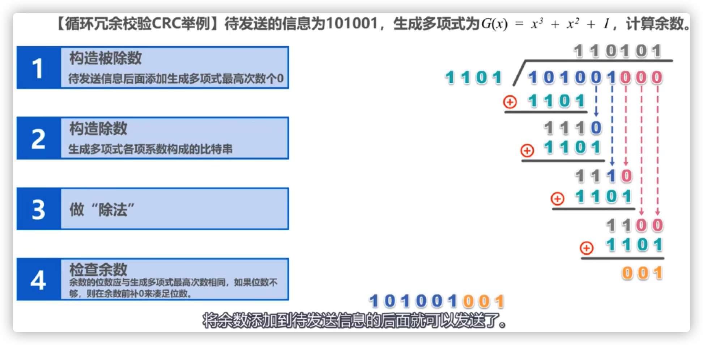
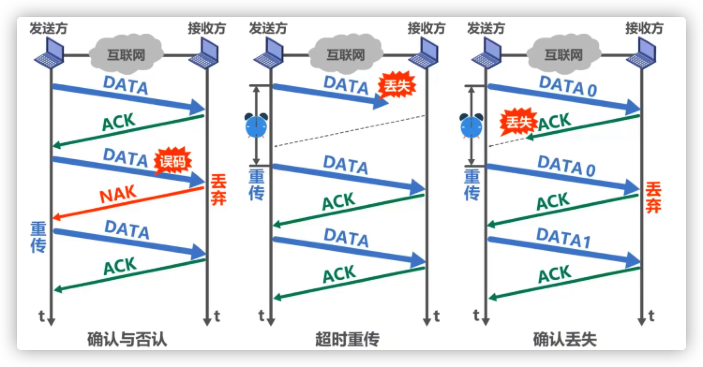
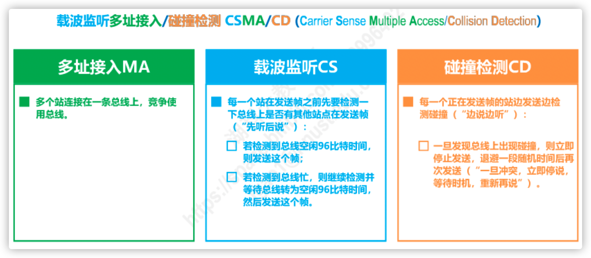
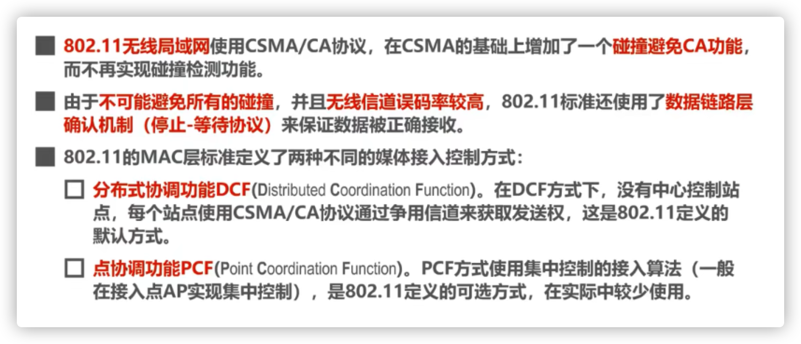
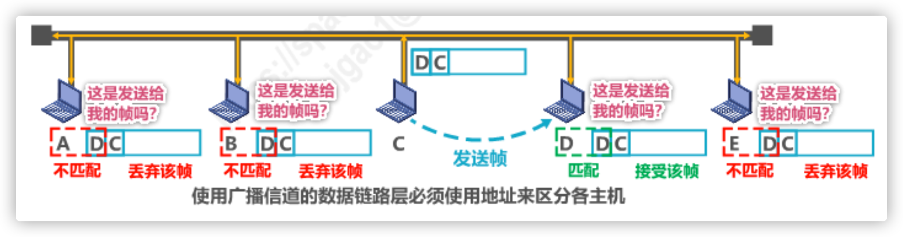
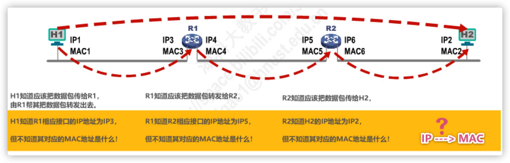

[TOC]

### 以太网和WIFI

1，Wi-Fi是无线网络，是一种可以将个人电脑、手持设备（如pad、手机）等终端以无线方式互相连接的技术，事实上它就是一个高频无线电信号。 WIFI可以做为小型无线局域网的代名词，可以看作是有线局域网的短距离无线延伸。 

2，以太网是有线网络，需要网线插入电脑才可以上网。 就是一种局域网，属于网络按地理分布范围划分的一种。 局域网一般范围比较小，最少由两台电脑连接。 wifi只是规定无线网络的频率和速度。 以太网是局域网标准，出了传输频率速度等等，还有规定数据企业外包it服务,机房服务器维护,综合布线弱电 链路层。 以太网的覆盖面比wifi广很多，二者不能相提并论。 电脑连接路由器任一LAN口，进入设置页面，设置、修改路由器WIFI名称（SSID）和密码即可。

# 1.概述

定义

- 链路（Link）就是从一个结点到相邻结点的一段物理线路，而中间没有任何其他的交换结点。
- 数据链路(Data Link）是指把实现通信协议的硬件和软件加到链路上，就构成了数据链路。
- 数据链路层以**帧**为单位传输和处理数据。

三个重要问题（针对点到点通信研究，而不是广播信道）

- 封装成帧 
- 差错检测 
- 可靠传输

# 2.封装成帧

# 3.差错检测

## 3.1.差错检测码

在一段时间内，传输错误的比特占所传输比特总数的比率称为**误码率BER(Bit Error Rate)**。

FCS字段是差错检测码

## 3.2.奇偶校验

### 奇偶校验

- 在待发送的数据后面添加1位奇偶校验位，使整个数据（包括所添加的校验位在内）中“1" 的个数为奇数（奇校验）或偶数（偶校验）。
-  如果有奇数个位发生误码，则奇偶性发生变化，可以检查出误码：
- 如果有偶数个位发生误码，则奇偶性不发生变化，不能检查出误码（漏检）：

由于漏检率高，一般网络中不采用

### 循环冗余校验CRC

#### 定义：

循环冗余校验CRC(Cyclic Redundancy Check)

- 收发双方约定好一个生成多项式G(x)；
- 发送方基于待发送的数据和生成多项式计算出差错检测码（冗余码），将其添加到待传输数据的后面一起传输；
-  接收方通过生成多项式来计算收到的数据是否产生了误码；

#### 常用的生成多项式：

#### 计算方法：

### 总结

- 检错码只能检测出帧在传输过程中出现了差错，但并不能定位错误，因此无法纠正错误。
- 要想纠正传输中的差错，可以使用冗余信息更多的纠错码进行前向纠错。但纠错码的开销比较大，在计算机网络中较少使用。
- 循环冗余校验CRC有很好的检错能力（漏检率非常低），虽然计算比较复杂，但非常易于用硬件实现，因此被广泛应用于数据链路层。
- 在计算机网络中通常采用我们后续课程中将要讨论的**检错重传方式**来纠正传输中的差错，或者仅仅是**丢弃检测到差错的帧**，这取决于数据链路层向其上层提供的是可靠传输服务还是不可靠传输服务。

# 4.可靠传输

## 4.1.基本概念

- 使用差错检测技术（例如循环冗余校验CRC），接收方的数据链路层就可检测出帧在传输过程中是否产生了误码**（比特错误）**
- 数据链路层向上层提供的服务类型
  - 不可靠传输服务：仅仅丢弃有误码的帧，其他什么也不做；
  - 可靠传输服务：想办法实现发送端发送什么，接收端就收到什么。

- 一般情况下，**有线链路**（以太网）的误码率比较低，为了减小开销，并**不要求**数据链路层向上提供可靠传输服务。即使出现了误码，可靠传输的问题由其上层处理。
- **无线链路**（802.11无线局域网）易受干扰，误码率比较高，因此要求**数据链路层必须向上层提供可靠传输**服务。

#### 整个计算机网络中的可靠传输

- **比特差错**只是传输差错中的一种。

- 从整个计算机网络体系结构来看，传输差错还包括分组丢失、分组失序以及分组重复。

- 分组丢失、分组失序以及分组重复这些传输差错，一般不会出现在数据链路层，而会
  出现在其上层。

- **可靠传输服务并不仅局限于数据链路层，其他各层均可选择实现可靠传输。**

  

## 4.2.可靠传输的实现

### 4.2.1.停止-等待SW

#### 基本原理：超时重传

#### 避免重复分组：给每个分组带上序号

为避免分组重复这种传输错误，必须给每个分组带上序号。

对于停止-等待协议，**由于每发送一个数据分组就停止等待**，**只要保证每发送一个新的数据分组，其发送序号与上次发送的数据分组的序号不同就可以了**，因此用**一个比特**来编号就够了。

#### 避免确认迟到： 给确认分组编号

#### 注意事项

- 接收端检测到数据分组有误码时，将其丢弃井等待发送方的超时重传。但对于**误码率较高的点对点链路，为使发送方尽早重传，也可给发送方发送NAK分组**
- 为了让接收方能够判断所收到的数据分组是否是重复的，需要给数据分组编号。由于停止-等待协议的**停等特性，只需1个比特编号**就够了，即编号0和1。
- 为了让发送方能够判断所收到的ACK分组是否是重复的，需要给ACK分组编号，所用比特数量与数据分组编号所用比特数量一样。**数据链路层一般不会出现ACK分组迟到的情况，因此在数据链路层实现停止-等待协议可以不用给ACK分组编号。**
- 超时计时器设置的重传时间应仔细选择。一般可将重传时间选为路大于“从发送方到接收方的平均往返时间”，
  - 在数据链路层点对点的往返时间比较确定，重传时间比较好设定。
  - 然而在运输层，由于端到端往返时间非常不确定，设置合适的重传时间有时井不容易。

#### 信道利用率

- 当往返时延RTT远大于数据帧发送时延To时（例如使用卫星链路），信道利用率非常低
- 若出现重传，则对于传送有用的数据信息来说，信道利用率还要降低。
- 为了克服停止-等待协议信道利用率很低的缺点，就产生了另外两种协议，即后退N帧协议GBN和选择重传协议SR。

### 4.2.2.回退N帧GBN

- 回退N帧协议在流水线传檢的基础上利用发送窗口来限制发送方连续发送数据分组的数量，是一种连续ARQ协议。
- 在协这的正作过程中发送窗口和接收窗口不街向前滑动。因此这类协议又称为滑动窗口协议。
- 由于回退N顺协议的特性，当通信线路质量不好时。其信道利用事井不比停止 等待物议高。

- 注意：GBN的接受窗口大小为1！！！

### 4.2.3.选择重传SR

#### GBN的缺陷

- 回退N帧协议的接收窗口尺寸WR只能等于1，因此接收方只能按序接收正确到达的数据分组。
- 一个数据分组的误码就会导致其后续多个数据分组不能被接收方按序接收而丢弃（尽管它们无乱序和误码）。这必然会造成发送方对这些数据分组的超时重传，显然这是对通信资源的极大浪费。
- 为了进一步提高性能，可设法只重传出现误码的数据分组。因此，**接收窗口的尺寸WR不应再等于1（而应大于1）**，以便接收方先收下失序到达但无误码井且序号落在接收窗口内的那些数据分组，等到所缺分组收齐后再一并送交上层。这就是选择重传协议。

注意：选择重传协议为了使发送方仅重传出现差错的分组**，接收方不能再采用累积确认**，而需要对每个正确接收到的数据分组进行逐一确认！

#### SR总结

# 5.点对点协议PPP

- 点对点协议PPP(Point-to-Point Protocol)是目前使用最广泛的点对点数据链路层协议。

  

### PPP协议定义的三部分

PPP协议为在点对点链路传输各种协议数据报提供了一个标准方法，主要由以下三部分构成：

- 对各种协议数据报的封裝方法（封装成帧）
- 链路控制协议LCP 用于建立、配置以及测试数据链路的连接
- 一套网络控制协议NCPs 其中的每一个协议支持不同的网络层协议

### PPP协议帧格式

#### 透明传输

##### 面对字节的异步链路：插入转义字符

##### 面对比特的同步链路：插入比特0

## PPP的差错检验

- 接收方每收到一个PPP帧，就进行CRC检验。若CRC检验正确，就收下这个帧；反之，就丢弃这个帧。
- **使用PPP的数据链路层向上不提供可靠传输服务。**

## HDLC：一种可靠的链路层协议

- **HDLC - High-Level Data Link Control** 

  A pretty old, but widely used protocol for point-to-point connections.  bit-oriented.

  HDLC supports flow control and error control

  HDLC is **designed to be reliable**

- **PPP- The Point-to-Point Protocol** 

  Internet standard (RFC1661 1662 1663), is used in the Internet for a variety of purposes, including router-to-router traffic and home user-to-ISP traffic. byte-oriented 

# 6.媒体接入控制MAC

## 6.1.MAC基本概念

共享信道要着重考虑的一个问题就是如何协调多个发送和接收站点对一个共享传输媒体的占用，即媒体接入控制MAC(Medium Access Control)。

## 6.2.静态划分信道Channel Partitioning (static)

### 6.2.1.信道复用

- 复用(Multiplexing）是通信技术中的一个重要概念。复用就是通过一条物理线路同时传输多路用户的信号。
- 当网络中传输媒体的传输容量大于多条单一信道传输的总通信量时，可利用复用技术在一条物理线路上建立多条通信信道来充分利用传输媒体的带宽。

### 6.2.2.FDM

### 6.2.3.TDM

### 6.2.4.CDM

- 码分复用CDM是另一种共享信道的方法。实际上，由于该技术主要用于多址接入，人们更常用的名词是码分多址CDMA(Code Division Multiple Access)。
- 同理，频分复用FDM和时分复用TDM同样可用于多址接入，相应的名词是频分多址FDMA(Frequency Division Multiple Access)和时分多址TDMA(Time Division Multiple Access)。
- 在本课程中，我们不严格区分复用与多址的概念。可简单理解如下：
  - 复用是将单一媒体的频带资源划分成很多子信道，这些子信道之间相互独立，互不干扰。从媒体的整体频带资源上看，每个子信道只占用该媒体频带资源的一部分。
  - 多址(更确切地应该称为多点接入）处理的是**动态分配信道给用户**。这在用户仅仅暂时性地占用信道的应用中是必须的，而所有的移动通信系统基本上都属于这种情况。相反，在信道永久性地分配给用户的应用中，多址是不需要的（对于无线广播或电视广播站就是这样）。
  - **某种程度上，FDMA. TDMA.CDMA可以分别看成是FDM，TDM. CDM的应用。**

- 与FDM和TDM不同，CDM的每一个用户可以在同样的时间使用同样的频带进行通信。
- **由于各用户使用经过特殊挑选的不同码型，因此各用户之间不会造成干扰。**

#### CDMA原理

#### CDMA码片挑选原则

码片序列的挑选原则如下：
1. 分配给每个站的码片序列必须各不相同，实际常采用**伪随机码序列**，

2. 分配给每个站的码片序列必须**相互正交**（规格化内积为0)。

  - 令向量S表示站S的码片序列，令向量T表示其他任何站的码片序列。

  - 两个不同站S和T的码片序列正交，就是向量S和丁的规格化内积为0：
    $$
    S \cdot T \equiv 0 \quad S \cdot \bar{T} \equiv 0 \quad S \cdot S \equiv 1 \quad S \cdot \bar{S} \equiv-1
    $$
    

## 6.3.随机接入random access (dynamic),

### 6.3.1.CSMA/CD

#### 缩写解释

96比特时间：

- 96比特时间是指发送96比特所耗费的时间，也称为帧间最小间隔。其作用是使接收方可以检测出一个帧的结束。同时也使得所有其他站点都能有机会平等竞争信道并发送帧。

以太网还采取一种叫做**强化碰撞**的措施。这就是当发送帧的站点一旦检测到碰撞，除了立即停止发送帧外，还要再继续发送32比特或48比特的**人为干扰信号(JammingSignal)**，**以便有足够多的碰撞信号使所有站点都能检测出碰撞。**

#### 争用期（碰撞窗口）

- 主机D以为信道是空闲的是，实际上不是，只是D检测不出来而已，在一段时间内，会存在这个问题，这个时间就称为争用期

- 主机最多经过$2 \tau(\text { 即 } \delta \rightarrow 0)$的时长就可检测到本次发送是否遭受了碰撞
- 因此，**以太网的端到端往返传播时延2$\tau$称为争用期或碰撞窗口**。
  经过争用期这段时间还没有检测到碰撞，才能肯定这次发送不会发生碰撞。

- 每一个主机在自己发送帧之后的一小段时间内，存在着遭遇碰撞的可能性。这一小段时间是不确定的。它取决于另一个发送帧的主机到本主机的距离，但不会超过总线的端到端往返传播时延，即一个争用期时间。
- 显然，在以太网中发送帧的主机越多，端到端往返传播时延越大，发生碰撞的概率就越大。因此，**共享式以太网不能连接太多的主机，使用的总线也不能太长。**
  - 10Mb/s以太网把争用期定为512比特发送时间，即51.2us，因此其总线长度不能超过5120m，但考虑到其他一些因素，如信号衰减等，以太网规定总线长度不能超过2500m。

#### 最小帧长

- 如果主机A发送了一个很短的帧,就会很快结束对该帧的碰撞检测，也就不知道不知道已发送完毕的该帧遭遇了碰撞，不会重发该帧
- 所以，以太网的帧长不能太短！！

- 以太网规定最小帧长为64字节，即512比特（512比特时间即为争用期）；
  - 如果要发送的数据非常少，那么必须加入一些填充字节，使帧长不小于64字节。
- 以太网的最小帧长确保了主机可在帧发送完成之前就检测到该帧的发送过程中是否 遭遇了碰撞；
  - 如果在争用期（共发送64字节）没有检测到碰撞，那么后续发送的数据就一定不会发生碰撞；
  - 如果在争用期内检测到碰撞，就立即中止发送，这时己经发送出去的数据一定小于64字节，因此**凡长度小于64字节的帧都是由于碰撞而异常中止的无效帧。**

#### 最大帧长

#### 检测到碰撞后：截断二进制指数退避算法TBEB

截断二进制指数退避（Truncated Binary Exponential Back—off,TBEB）算法

#### 信道利用率

#### 帧发送流程

#### 帧接受流程

## 6.3.2.CSMA/CA

#### 为什么无线局域网不能用CSMA/CD

##### 隐蔽站hidden terminal problem

#### 缩写解释

# 7.MAC地址，IP地址，ARP协议

- MAC地址是以太网的MAC子层所使用的地址；
- IP地址是TCP/P体系结构网络层所使用的地址;
- ARP协议属于TCP/1P体系结构的网络层，其作用是已知设备所分配到的/P地址，使用ARP协议
  可以通过该IP地址获取到设备的MAC地址；
- 尽管IP地址和ARP协议属于TCP/IP体系结构的网际层（而不属于数据链路层），但是它们与MAC地址存在一定的关系，并且我们日常的网络应用都离不开MAC地址、1P地址以及ARP协议。•因此，我们将这三者放在一起讨论。

## 7.1.MAC地址

- 当多个主机连接在同一个广播信道上，要想实现两个主机之间的通信，则每个主机都必须有一个唯一的标识，即一个数据链路层地址；

  

- 在每个主机发送的帧中必须携带标识发送主机和接收主机的地址。由于这类地址是**用于媒体接入控制MAC (Media Access Control)，因此这类地址被称为MAC地址；**

  - MAC地址一般被固化在网卡（网络适配器）的电可擦可编程只读存储器EEPROM中，因此MAC地址也被称为硬件地址;

    

  - MAC地址有时也被称为物理地址。请注意：这并不意味着MAC地址属于网络体系结构中的物理层！

- •一般情况下，用户主机会包含两个网络适配器：有线局域网适配器（有线网卡）和无线局域网适配器（无线•网卡）。每个网络适配器都有一个全球唯一的MAC地址。而交换机和路由器往往拥有更多的网络接口，所以•会拥有更多的MAC地址。综上所述，严格来说，**MAC地址是对网络上各接口的唯一标识，而不是对网络上•各设备的唯一标识**。

### IEEE802局域网MAC地址格式

单播MAC地址

广播MAC地址

多播MAC地址

随机MAC地址

## 7.2.IP地址

### 数据包转发过程中/P地址与MAC地址的变化情况

- 数据包转发过程中源IP地址和目的1P地址保持不变；
- 数据包转发过程中源MAC地址和目的MAC地址逐个链路(或逐个网络）改变。

### 如何通过IP地址找到MAC地址？ARP

## 7.3.地址解析协议ARP

看视频或者ppt的图

- Address Resolution Protocol

- 每台主机都有一个ARP高速缓存表

  

- 源主机在自己的ARP高速级存表中查找目的主机的IP地址所对应的MAC地址，若找到了，则可以封裝MAC核进行发送；若找不到，则发送ARP请求（封装在广播MAC帧中）

- 目的主机收到ARP请求后，将源主机的IP地址与MAC地址记录到自己的ARP高速缓存表中，然后给源主机发送ARP响应（封装在单播MAC帧中），ARP喻应中包含有目的主机的1P地址和MAC地址：

- 源主机收到ARP的应后，将目的主机的1P地址与MAC地址记录到自己的ARP高速缓存表中，然后就可以對装之前想发送的MAC帧井发送给目的主机；

  注意！以上存储的都是动态类型的MAC记录，存活周期2min

- ARP的作用范围：逐段链路或逐个网络使用；

- 除ARP请求和响应外，ARP还有其他类型的报文（例如用于检查1P地址冲突的“无故ARP、免费ARP(GratuitousARP)”）：

- ARP没有安全验证机制，存在ARP飲路（政击）向题，

# 8.集线器与交换机的区别

### 总线型以太网和星形以太网

### 集线器

### 交换机

### 集线器和交换机

