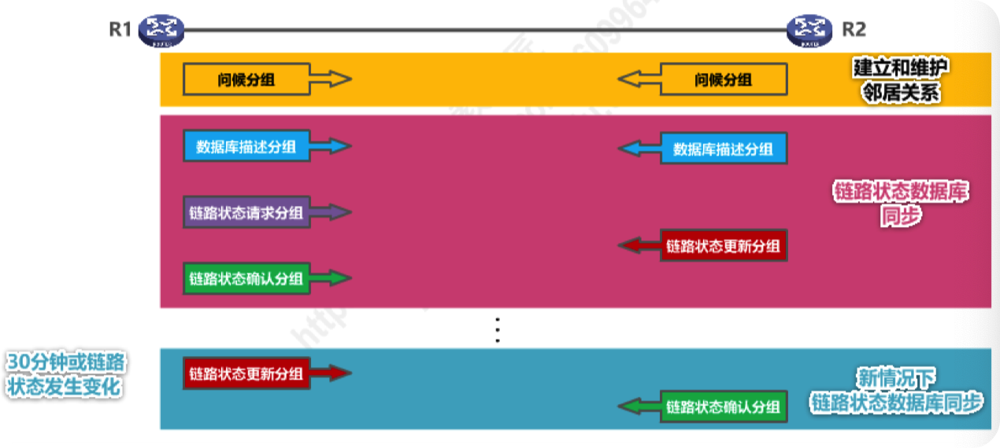

[TOC]

# 4.6.路由选择协议

## 4.6.1.概述

### 路由选择协议的主要特点

因特网所采用的路由选择协议的主要特点：

- 自适应：动态路由选择，能较好地适应网络状态的变化

- 分布式：路由器之间交换路由信息

- 分层次；将整个因特网划分为许多较小的自治系统AS(Autonomous System)

  

### 常见的路由选择协议

### 路由器的基本结构

路由器可以看成由两个主要部分组成：

- 路由选择部分
- 分组转发部分

如果输入端口处是：

- 只需直接转发的**数据分组**：直接按照给定的端口转发，
- 路由器之间交换路由信息的**路由报文**：交给路由选择处理机处理，更新路由表转发表从路由表得出

## 4.6.2.路由信息协议RIP

### 工作原理

路由信息协议RIP(Routing Information Protocol)是内部网关协议IGP中最先得到广泛使用的协议之一

RIP要求自治系统AS内的每一个路由器都要维护从它自己到AS内其他每一个网络的距离记录。这是一组距离，称为“**距离向量D-V(Distance-Vector)**”

RIP使用**跳数(Hop Coum)**作为度量(Metric)来衡量到达目的网络的距离。

- 路由器到直连网络的距离定义为1。
- 路由器到非直连网络的距离定义为所经过的路由器数加1。
- 允许一条路径最多只能包含15个路由器。**“距离”等于16时相当于不可达**。因此，RIP只适用于小型互联网。

RIP认为好的路由就是“距离短〞的路由，也就是**所通过路由器数量最少**的路由。

当到达同一目的网络有多条“距离相等“的路由时，可以进行等价**负载均衡**。

RIP包含以下三个要点：

- 和谁交换信息：仅和相邻路由器交换信息
- 交换什么信息：自己的路由表
- 何时交换信息：周期性交换 （例如每30秒）

### 工作过程

路由器刚开始工作时，只知道自己到直连网络的距离为1。

每个路由器仅和相邻路由器周期性地交换井更新路由信息。

若干次交换和更新后，每个路由器都知道到达本AS内各网络的最短距离和下一跳地址，称为收敛。

## 4.6.3. 开放最短路径优先OSPF

开放最短路径优先OSPF(Open Shortest Path First)，是为克服RIP的缺点在1989年开发出来的。

- “开放〞表明OSPF协议不是受某一家厂商控制，而是公开发表的。 
- “最短路径优先〞是因为使用了Djkstra提出的最短路径算法SPF。

OSPF是基于链路状态的，而不像RIP那样是基于距离向量的。OSPF采用SPF算法计算路由，从算法上保证了不会产生路由环路。

OSPF不限制网络规模，更新效率高，收敛速度快。

链路状态是指本路由器都和哪些路由器相邻，以及相应链路的“代价” (cost)，“代价〞用来表示费用、距离、时延、带宽，等等。这些都由网络管理人员来决定。

### 工作过程

1. OSPF相邻路由器之间通过交互问候（Hello）分组，建立和维护邻居关系。

   - Hello分组封装在/P数据报中，发往组播地址224.0.0.5；

   - 发送周期为10秒

   - 40秒未收到来自邻居路由器的Hello分组，则认为该邻居路由器不可达。

     

2. OSPF相邻路由器之间通过交互问候（Hello）分组，建立和维护邻居关系。

3. 使用OSPF的每个路由器都会产生**链路状态通告LSA(Link State Advertisement)**。LSA中包含以下内容：

   - 直连网络的链路状态信息 

   - 邻居路由器的链路状态信息

4. **LSA被封装在链路状态更新分组LSU中**，采用洪泛法发送。
5. 使用OSPF的每个路由器都有一个链路状态数据库LSDB，用于存储LSA。
6. 通过各路由器洪泛发送封装有自己LSA的LSU分组，各路由器的LSDB最终将达到一致。

5. 使用OSPF的各路由器基于LSDB进行最短路径优先SPF计算，构建出各自到达其他各路由器的最短路径，即构建各自的路由表。

### 分组类型

OSPF有以下五种分组类型

- 问候(Hello) 分组：用来发现和维护邻居路由器的可达性。
- 数据库描述 (Database Description)分组： 向邻居路由器给出自己的链路状态数据库中的所有链路状态项目的摘要信息
- 链路状态请求(Link State Request) 分组
- 链路状态更新 (Link State Update) 分组，里面封装了**链路状态通告LSA(Link State Advertisement)**
- 链路状态确认(Link State Acknowledgment)分组，==和上面的链路状态通告区分！！==

### 区域

为了使OSPF能适用于规模很大的网络，OSPF把一个自治系统再划分为若干个更小的范围，叫做区域（Area)

- 划分区域的好处就是把利用洪泛法交換链路状体信息的范围局限于每一个区城而不是整个自治系统，这就减少了整个网绍上的通信量。

## 4.6.4. 边界网关协议BGP

外部网关协议EGP（例如边界网关协议BGP)

- 在不同自治系统内，度量路由的“代价〞（距离，带宽，费用等）可能不同。
- 因此，对于自治系統之间的路由选择，使用“代价”作为度量来寻找最佳路由是不行的。
- 自治系统之间的路由选择必须考虑相关策略（政治，经济，安全等） 
- BGP只能是力求寻找一条能够多到达目的网络且比较好的路由（不能兜圈子），而井非要寻找一条最佳路由
- 在配置BGP时，每个自治系统的管理员要选择至少一个路由器作为该自治系统的 “BGP发言人”
- 不同自治系统的BGP发言人要交换路由信息，首先必须建立TCP连接，端口号为179
  - 在此TCP连接上交换BGP报文以建立BGP会话
  - 利用BGP会话交换路由信息（例如，增加新的路由，或撒销过时的路由，以及报告出错的情况等）
  - 使用TCP连接交换路由信息的两个BGP发言人，彼此称为对方的邻站 (neighbor)或对等站 (peer)
- BGP发言人除了运行BGP外，还必须运行自己所在自治系统所使用的内部网关协议IGP，例如OSPF或RIP。
- BGP发言人交换网络可达性的信息（要到达某个网络所要经过的一系列自治系統）
- 当BGP发言人互相交换了网络可达性的信息后，各BGP发言人就根据所采用的策略从收到的路由信息中找出到达各自治系统的较好的路由。也就是构造出树形结构，不存在回路的自治系统连通图。
- BGP适用于多级结构的因特网
- BGP-4有以下四种报文
  - OPEN(打开)报文：用来与相邻的另一个BGP发言人建立关系，使通信初始化。
  - UPDATE(更新)报文：用来通告某一路由的信息，以及列出要撒销的多条路由。
  - KEEPALIVE(保活)报文：用来周期性地证实邻站的连通性。
  - NOTIFICATION(通知)报文：用来发送检测到的差错。
